# Quizzy 🎓

**Quizzy** is a Flutter-based quiz application designed to provide an engaging and customizable quiz
experience.
The app follows the **MVVM architecture**, uses **Cubit (flutter_bloc)** for state management, and
integrates with an external **API** for quiz questions.

---

## ✨ Features

* **Onboarding Flow**:

    * 3 introduction screens (shown only on the first launch using SharedPreferences).

* **Login Screen**:

    * Enter your name to start playing.
    * If not a first-time user → skip onboarding directly to login.

* **Quiz Setup**:

    * Dropdown menus for category, difficulty, and number of questions.

* **Quiz Play**:

    * Displays questions and multiple-choice answers.
    * Countdown timer for each question.
    * Progress tracker:

        * Text format (e.g., `3/10 questions`).
        * Visual progress bar.

* **Quiz Result**:

    * Displays player name, score, and total number of questions.
    * Options:

        * **Try Again** → navigate to Quiz Setup.
        * **New Player** → navigate to Login.

---

## 🛠️ Tech Stack

* **Framework**: Flutter
* **Architecture**: MVVM
* **State Management**: Cubit (flutter_bloc)
* **API Handling**: Dio

---

## 📦 Packages

* `flutter_bloc` – State management
* `dio` – API requests
* `equatable` – Value equality
* `html_unescape` – Decode HTML entities
* `lottie` – Animations
* `flutter_launcher_icons` – Custom app icon
* `flutter_native_splash` – Splash screen
* `google_fonts` – Custom fonts
* `shared_preferences` – Persistent storage
* `flutter_screenutil` – Responsive UI
* `introduction_screen` – Onboarding flow
* `connectivity_plus` – Network connectivity

---

## 🚀 Getting Started

1. Clone the repository:

   ```bash
   git clone https://github.com/AYAEMAD0/Quizzy.git
   cd Quizzy
   ```

2. Install dependencies:

   ```bash
   flutter pub get
   ```

3. Run the app:

   ```bash
   flutter run
   ```

---

## 🔄 App Flow Diagram

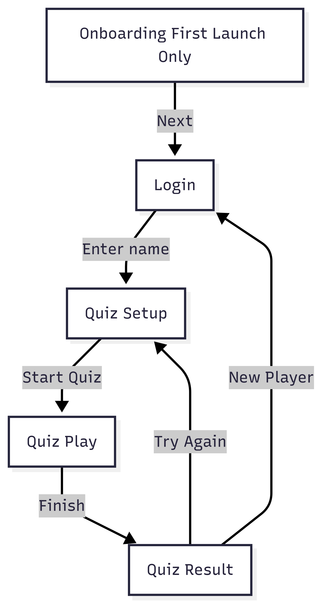

flowchart TD
    A[Onboarding (first launch only)] -->|Next| B[Login]
    B -->|Enter name| C[Quiz Setup]
    C -->|Start Quiz| D[Quiz Play]
    D -->|Finish| E[Quiz Result]
    E -->|Try Again| C
    E -->|New Player| B
```

---

## 🚀 Launcher & Splash

| Launcher                                     | Splash                                   |
|----------------------------------------------|------------------------------------------|
| 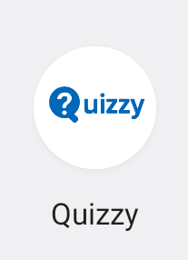 | 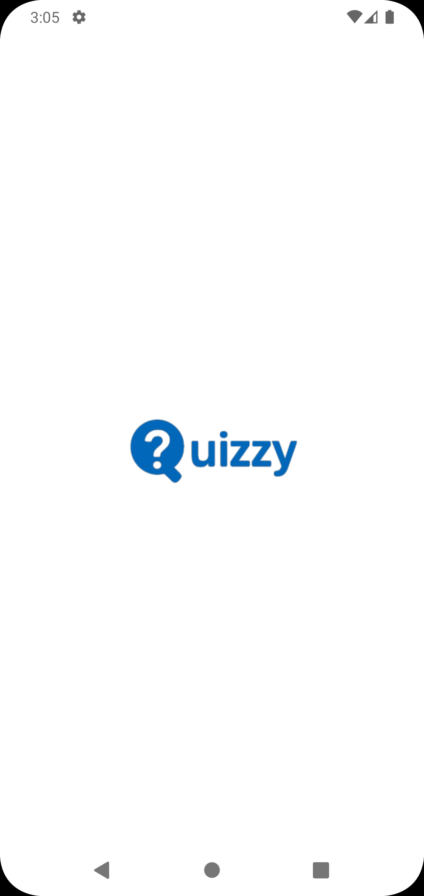 |

---

## 📸 Onboarding

| Onboarding 1                                         | Onboarding 2                                         | Onboarding 3                                           |
|------------------------------------------------------|------------------------------------------------------|--------------------------------------------------------|
| 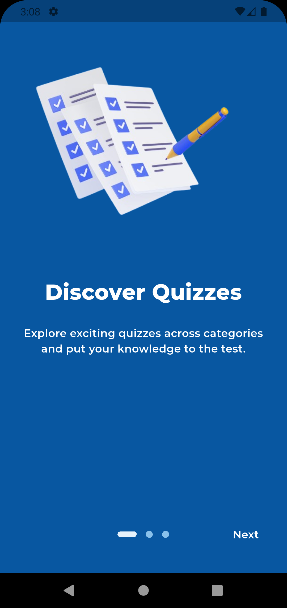 | 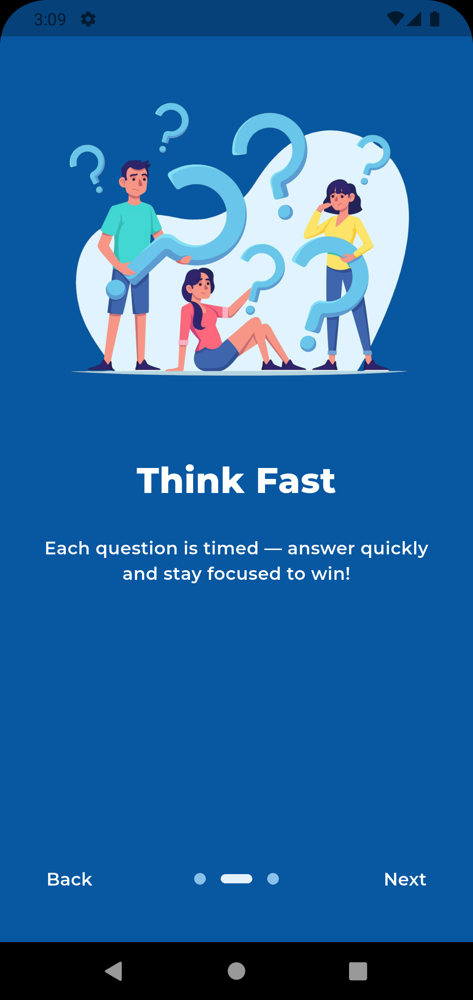 | 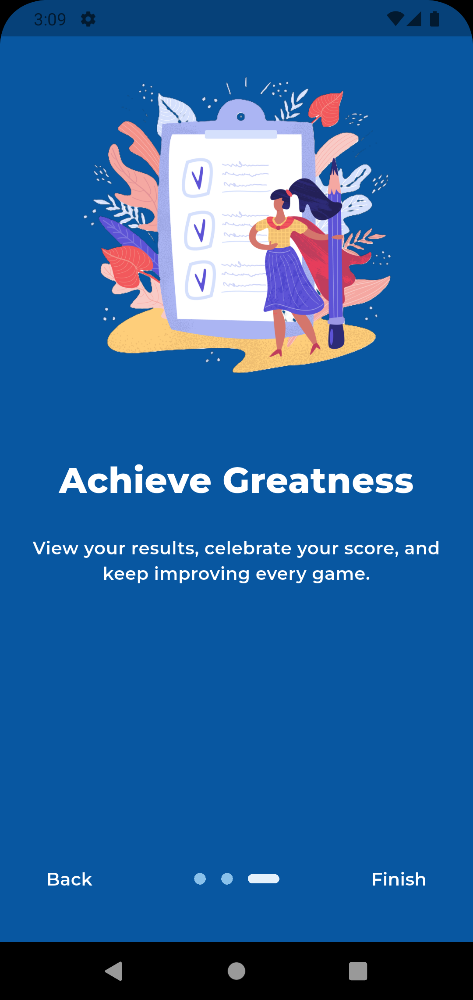 |

---

## 🔑 Login

| Login 1                                 | Login 2                                             | Login 3                                            |
|-----------------------------------------|-----------------------------------------------------|----------------------------------------------------|
| 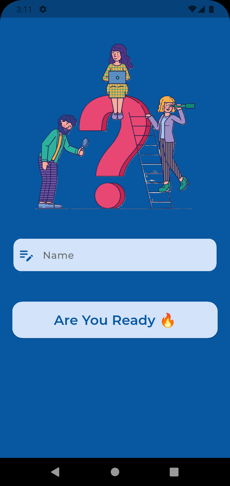 | 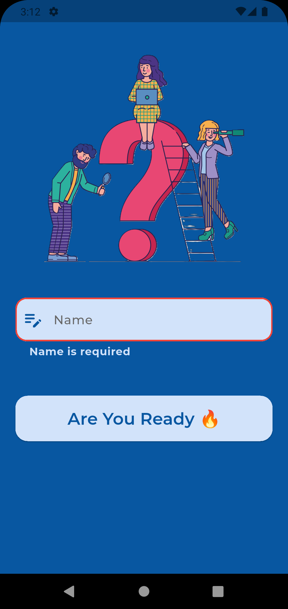 | 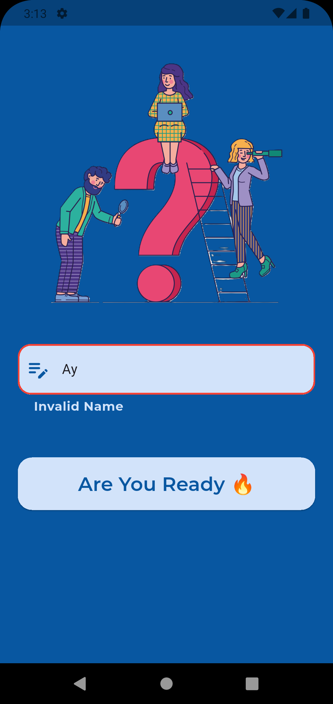 |

---

## ⚙️ Quiz Setup

| Setup 1                                     | Setup 2                                          | Setup 3                                              |
|---------------------------------------------|--------------------------------------------------|------------------------------------------------------|
| 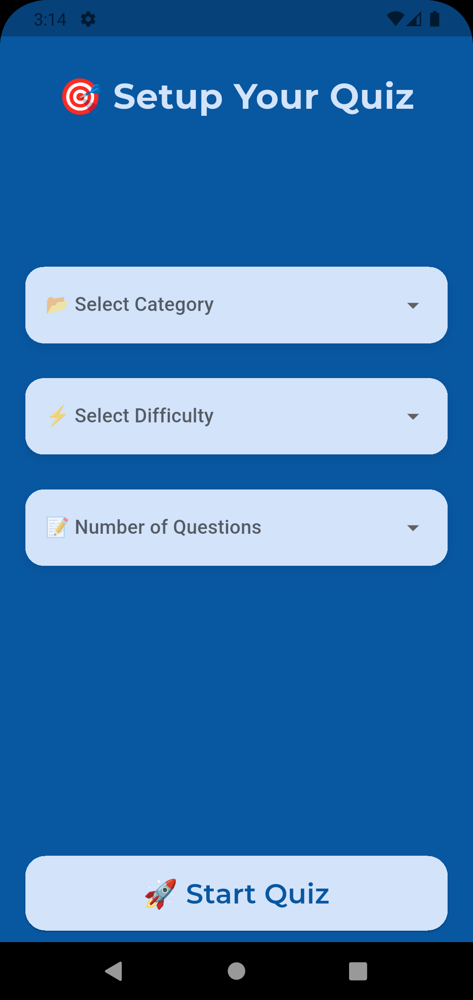 | 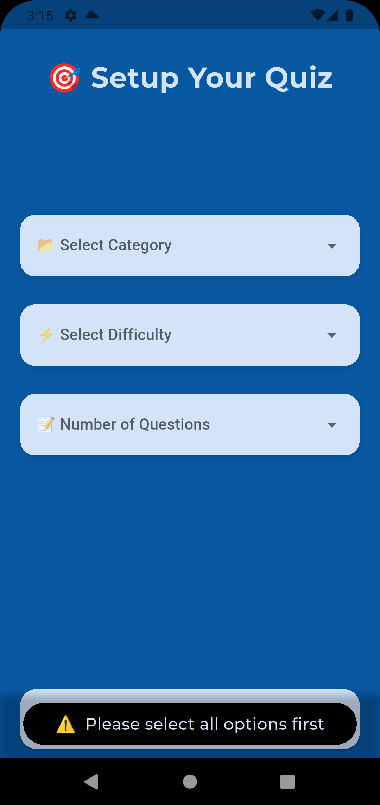 | 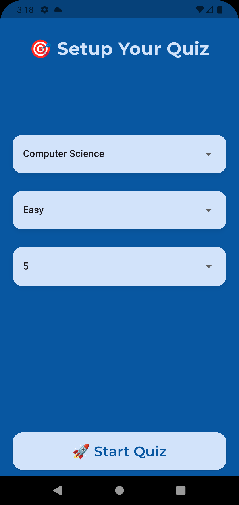 |

| Setup 4                                              | Setup 5                                              | Setup 6                                                |
|------------------------------------------------------|------------------------------------------------------|--------------------------------------------------------|
| 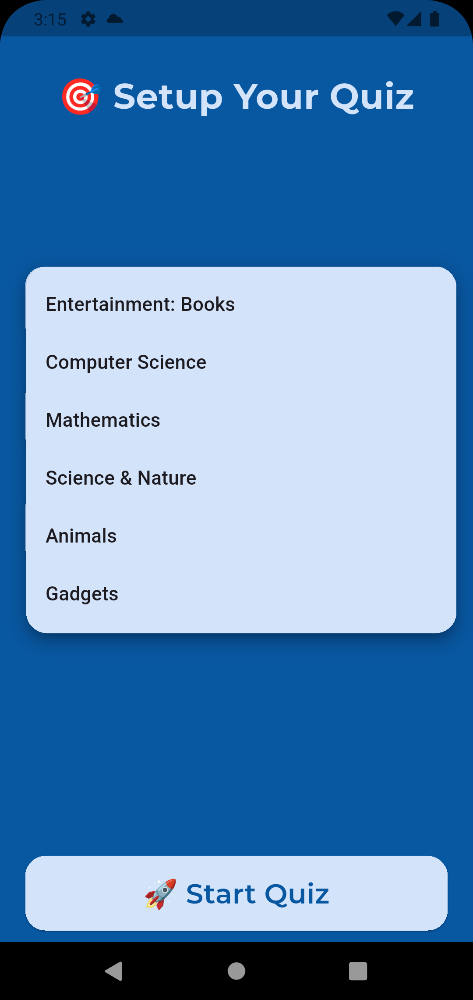 | 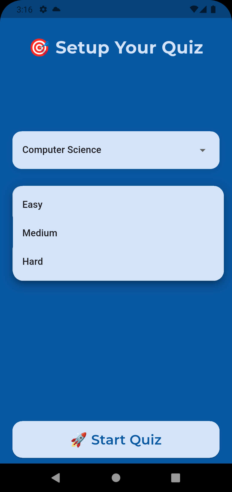 | 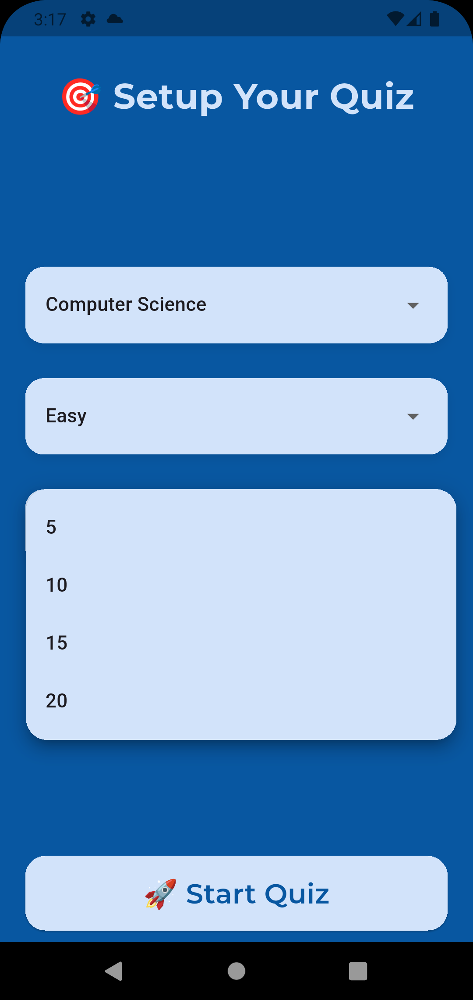 |

---

## 🎮 Quiz Play

| Play 1                                    | Play 2                                           | Play 3                                             | Play 4                                                      |
|-------------------------------------------|--------------------------------------------------|----------------------------------------------------|-------------------------------------------------------------|
| 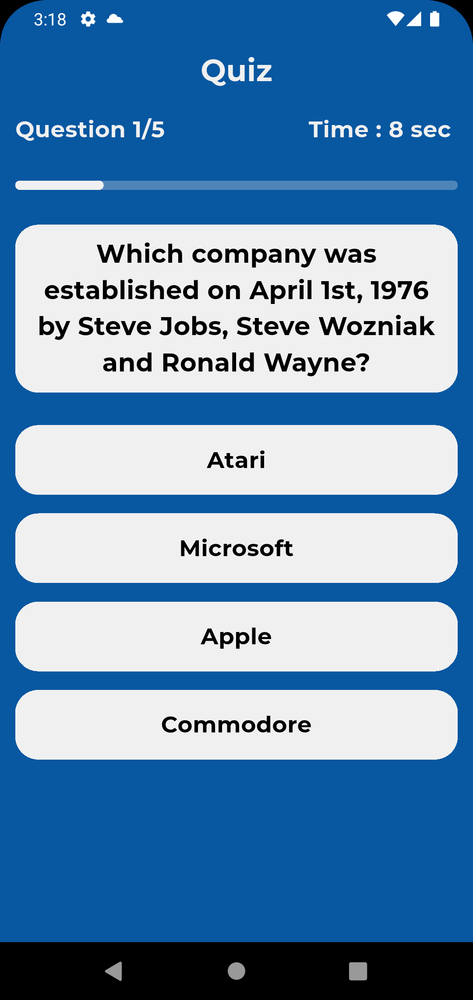 | 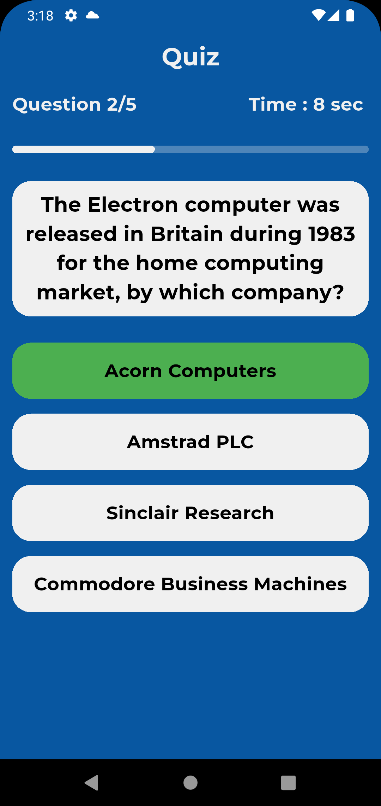 | 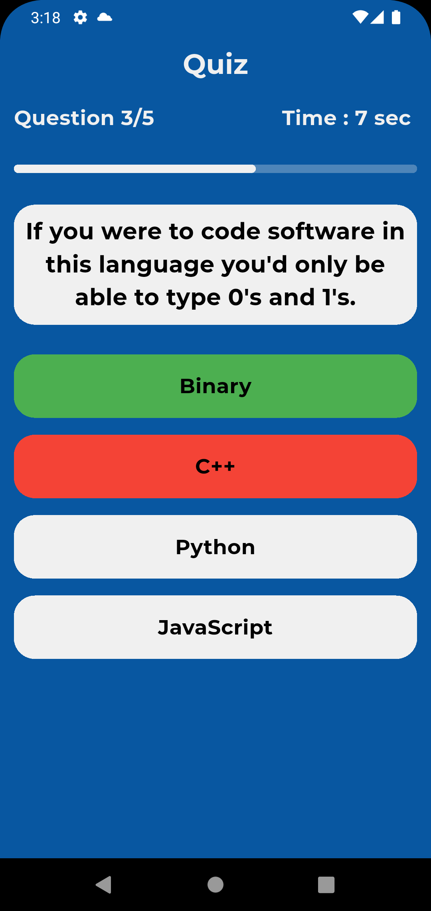 | 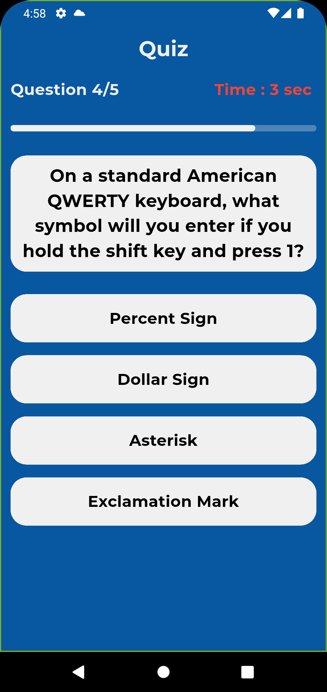 |

---

## 🏆 Quiz Result

| Result 1                                              | Result 2                                            |
|-------------------------------------------------------|-----------------------------------------------------|
| 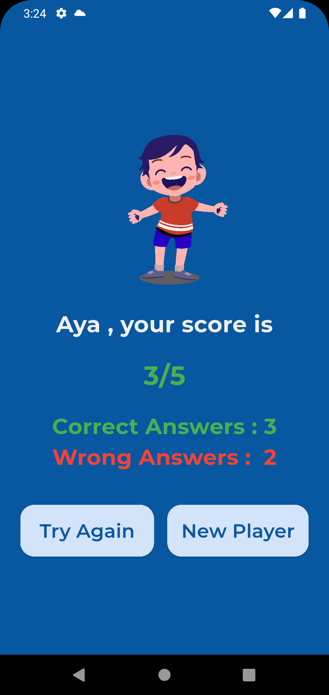 | 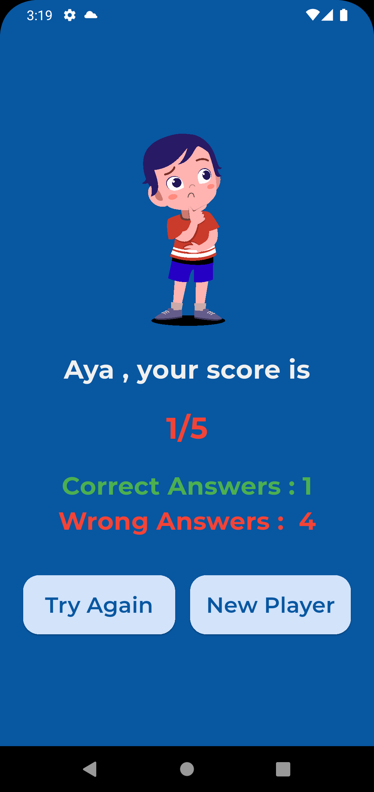 |

---

## 👩‍💻 Author

Developed by **Aya Emad**

* [GitHub](https://github.com/AYAEMAD0)
* [LinkedIn](https://www.linkedin.com/in/aya-emad1/)

---
